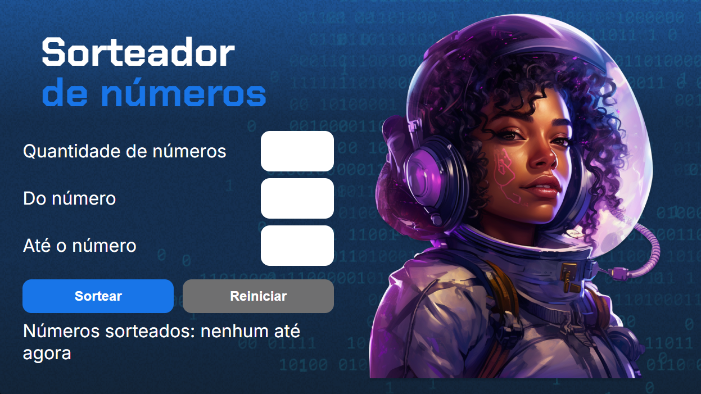

# AluraLogicaDesafios

## 1º projeto Sorteador de Números

Aplicação web para sortear os numeros entre um intervalo.

## ✔️ Técnicas e tecnologias utilizadas

As técnicas e tecnologias utilizadas pra isso são:

- `HTML`: criação dos elementos da tela;
- `CSS`: estilização da aplicação;
- `JavaScript`: construção de elementos dinâmicos através da manipulação do DOM.

